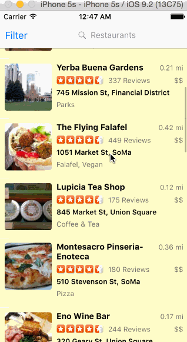

# Week 1 home work - Simple Yelp Applicaiton

Simple Yelp Applicaiton for iOS.

Submitted by: Phuong le

Time spent: 24 hours spent in total

## User Stories

The following **required** functionality is complete:

Search results page:

* [x] able rows should be dynamic height according to the content height.
* [x] Custom cells should have the proper Auto Layout constraints.
* [x] Search bar should be in the navigation bar (doesn't have to expand to show location like the real Yelp app does).

Filter page. Unfortunately, not all the filters in the real Yelp App, are supported in the Yelp API.

* [x] The filters you should actually have are: category, sort (best match, distance, highest rated), distance, deals (on/off).
* [x] The filters table should be organized into sections as in the mock.
* [x] Clicking on the "Search" button should dismiss the filters page and trigger the search w/ the new filter settings.

The following **optional** features are implemented:

* [x] Infinite scroll for restaurant results
* [x] Implement map view of restaurant results.
* [x] Distance filter should expand as in the real Yelp app.
* [x] Categories should show a subset of the full list with a "See All" row to expand.
* [ ] implement a custom switch.
* [ ] Implement the restaurant detail page.

## Video Walkthrough 

Here's a walkthrough of implemented user stories:

GIF created with [LiceCap](http://www.cockos.com/licecap/).

## Notes

- Many contraints in auto layout.
- Difficult in setting contraint for label.
- Setting cells custom is challenge in first time.

## License

Copyright [2016] [Phuong Le]

Licensed under the Apache License, Version 2.0 (the "License");
you may not use this file except in compliance with the License.
You may obtain a copy of the License at

http://www.apache.org/licenses/LICENSE-2.0

Unless required by applicable law or agreed to in writing, software
distributed under the License is distributed on an "AS IS" BASIS,
WITHOUT WARRANTIES OR CONDITIONS OF ANY KIND, either express or implied.
See the License for the specific language governing permissions and
limitations under the License.